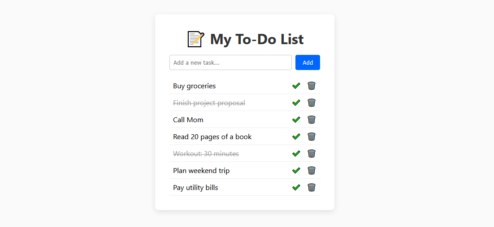

# 📝 To‑Do List App

A lightweight, persistent to‑do list built with pure HTML, CSS, and vanilla JavaScript. Add, complete, and delete tasks—all saved in `localStorage` so your list survives page reloads.

---

## Table of Contents

- [📝 To‑Do List App](#-todo-list-app)
  - [Table of Contents](#table-of-contents)
  - [Demo](#demo)
  - [Features](#features)
  - [Technologies](#technologies)
  - [Preview](#preview)
  - [Installation](#installation)

---

## Demo



---

## Features

- **Add tasks** with a single-line form  
- **Mark tasks complete** with a ✔️ button  
- **Delete tasks** with a 🗑️ button  
- **Persistent storage** via `localStorage`  
- **Responsive layout** that works on mobile and desktop  

---

## Technologies

- **HTML5**  
- **CSS3** (Flexbox, Custom Properties)  
- **JavaScript** (ES6+, `localStorage`)  

---

## Preview

- [Live Demo](https://codewithoyem.github.io/todo-list-100daysofcode/)

---

## Installation

1. **Clone the repository**  
   ```bash
   git clone https://github.com/codewithoyem/todo-list-100daysofcode.git
   cd todo-list-app
